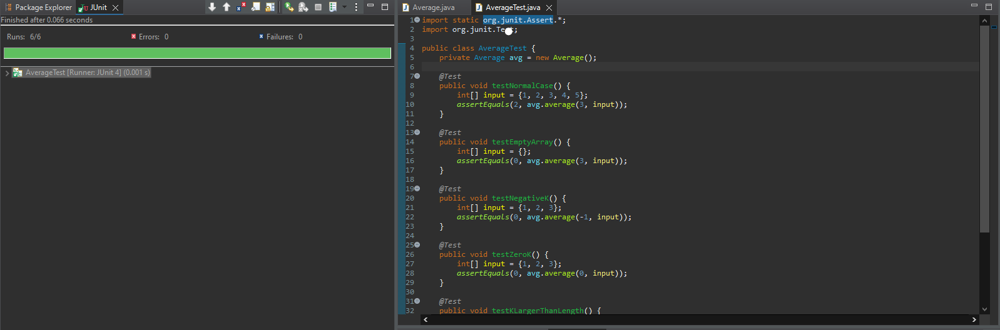
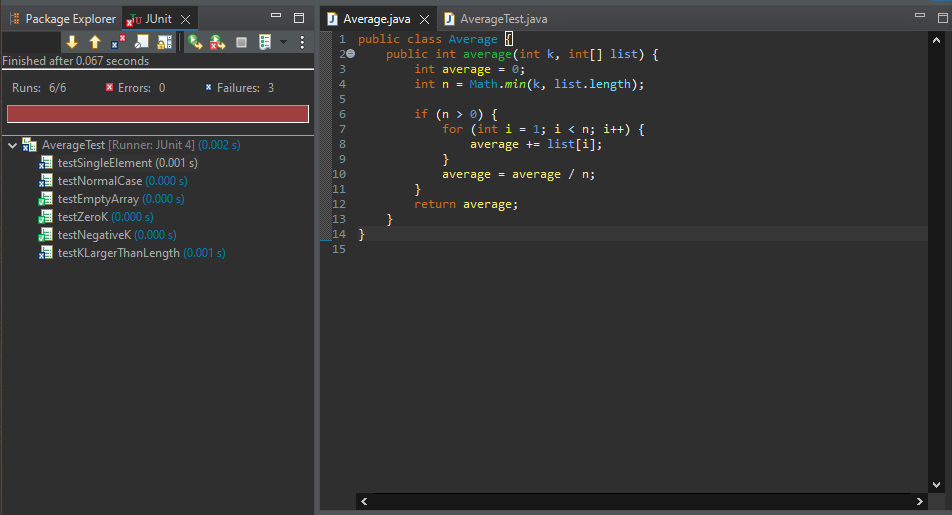
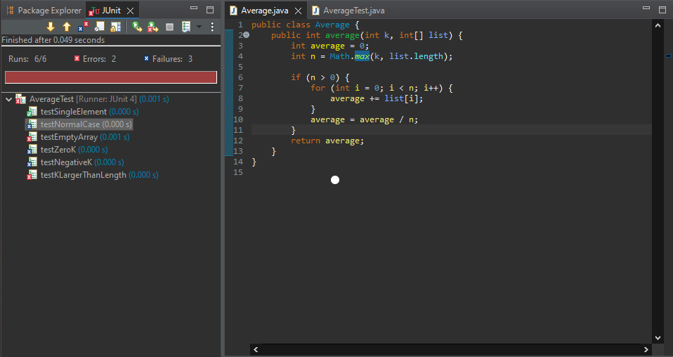
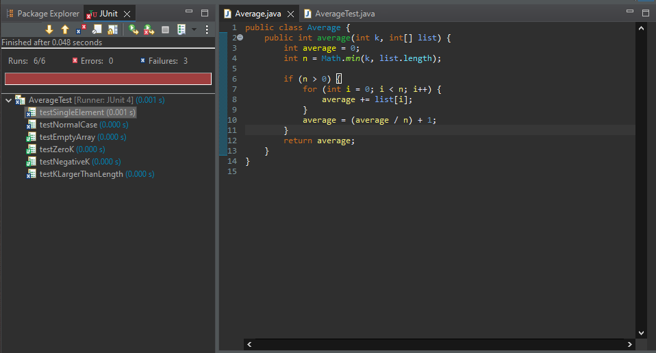
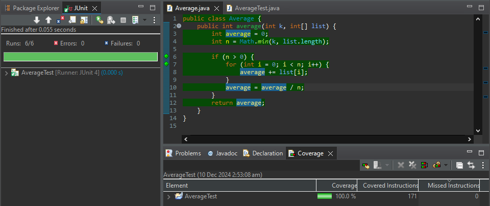

# a) Functional Description of the `average` Function

The `average` function calculates the average of a number of elements within an array of integers depending on a count parameter. Here is a detailed description of its functionality:

**Purpose:**  
Calculates the average (mean) value of the first k elements from an input integer array.

**Input Parameters:**
- `k`: An integer which tells us how many elements we are going to average.
- `list`: An integer array in which data about the values to be averaged are stored

**Functionality Details:**
1. If k ≤ 0 or the array is empty -> Returns 0
2. If k > array length -> Uses the entire array length instead of k
3. For valid inputs -> Calculates sum of first min(k, array length) elements and divides by that count

**Expected Behavior:**
- Integer arithmetic (handler or capable of returning an integer result)
- It returns 0 when one or both of the inputs are invalid or empty
- Utilizes array bounds check to avoid the occurrence of overflow
- Will process less than k or the length of the array.

**Examples:**
- `average(3, [1,2,3,4,5])` -> Returns 2 (calculates (1+2+3)/3)
- `average(5, [10,20,30])` -> Returns 20 (uses all elements since k > length)
- `average(0, [1,2,3])` -> Returns 0 (k ≤ 0)
- `average(2, [])` -> Returns 0 (empty array)


# b) Functional Test Cases

**Test Cases for Average Function**

| Test Case ID | Description | Input Values | Expected Output | Test Category |
|-------------|-------------|--------------|-----------------|---------------|
| TC1 | Normal case - subset of array | k=3, list=[2,4,6,8,10] | 4 | Basic functionality |
| TC2 | All elements average | k=3, list=[3,6,9] | 6 | Complete array |
| TC3 | Empty array | k=2, list=[] | 0 | Error handling |
| TC4 | Negative k value | k=-1, list=[1,2,3] | 0 | Error handling |
| TC5 | Zero k value | k=0, list=[5,10,15] | 0 | Error handling |
| TC6 | Single element | k=1, list=[7] | 7 | Edge case |
| TC7 | k larger than array | k=5, list=[2,4,6] | 4 | Boundary case |
| TC8 | Large numbers | k=3, list=[1000,2000,3000] | 2000 | Range testing |

**Test Case Details:**

1. **TC1**: Tests basic average calculation with subset
   - Input: k=3, array has 5 elements
   - Expected: (2+4+6)/3 = 4

2. **TC2**: Tests when k equals array length
   - Input: k=3, array has 3 elements
   - Expected: (3+6+9)/3 = 6

3. **TC3**: Tests empty array handling
   - Input: Empty array
   - Expected: 0 (error case)

4. **TC4**: Tests negative k handling
   - Input: Negative k value
   - Expected: 0 (error case)

5. **TC5**: Tests zero k handling
   - Input: k=0
   - Expected: 0 (error case)

6. **TC6**: Tests single element processing
   - Input: One-element array
   - Expected: Element value

7. **TC7**: Tests k > array length
   - Input: k larger than array size
   - Expected: Average of all elements

8. **TC8**: Tests with large numbers
   - Input: Large integers
   - Expected: Correct average calculation


# c) Partitions and Partition Test Cases

### 1. Input Space Partitions

**For parameter k:**
| Partition | Range | Example Value |
|-----------|-------|---------------|
| Invalid k | k ≤ 0 | -1, 0 |
| Valid k (small) | 1 ≤ k ≤ list.length | 1, 2 |
| Valid k (large) | k > list.length | list.length + 1 |

**For parameter list:**
| Partition | Description | Example |
|-----------|-------------|----------|
| Empty list | list.length = 0 | [] |
| Single element | list.length = 1 | [5] |
| Multiple elements | list.length > 1 | [1,2,3] |

### 2. Partition Test Cases

| Partition Combination | Test Case | Input | Expected Output | Rationale |
|----------------------|-----------|--------|-----------------|-----------|
| Invalid k + Non-empty list | PT1 | k=-1, list=[1,2,3] | 0 | Testing negative k |
| Invalid k + Non-empty list | PT2 | k=0, list=[1,2,3] | 0 | Testing zero k |
| Valid k + Empty list | PT3 | k=2, list=[] | 0 | Testing empty array |
| Valid k (small) + Single element | PT4 | k=1, list=[5] | 5 | Testing single element |
| Valid k (small) + Multiple elements | PT5 | k=2, list=[2,4,6] | 3 | Testing subset average |
| Valid k (large) + Multiple elements | PT6 | k=5, list=[2,4,6] | 4 | Testing k > length |

### 3. Partition Analysis Rationale

1. **k partitions:**
   - k ≤ 0: Tests error handling
   - 1 ≤ k ≤ list.length: Tests normal operation
   - k > list.length: Tests boundary behavior

2. **list partitions:**
   - Empty: Tests error handling
   - Single element: Tests minimal case
   - Multiple elements: Tests normal operation


# d) Boundary Value Test Cases

### 1. Boundary Value Analysis

**For parameter k:**
| Boundary | Value | Type |
|----------|--------|------|
| Minimum invalid | -1 | Invalid boundary |
| Zero | 0 | Invalid boundary |
| Minimum valid | 1 | Valid boundary |
| Equal to list length | n | Valid boundary |
| Just above list length | n+1 | Valid boundary |

**For parameter list:**
| Boundary | Value | Type |
|----------|--------|------|
| Empty list | [] | Minimum boundary |
| Single element | [x] | Minimum valid boundary |
| Two elements | [x,y] | Minimum multiple elements |

### 2. Boundary Test Cases

| Test ID | Description | Input | Expected Output | Rationale |
|---------|-------------|--------|-----------------|-----------|
| BT1 | Negative k | k=-1, list=[1,2,3] | 0 | Testing minimum invalid k |
| BT2 | Zero k | k=0, list=[1,2,3] | 0 | Testing zero boundary |
| BT3 | k=1, minimal list | k=1, list=[5] | 5 | Testing minimum valid k with minimum valid list |
| BT4 | k=length | k=3, list=[1,2,3] | 2 | Testing k equal to length |
| BT5 | k=length+1 | k=4, list=[1,2,3] | 2 | Testing k just above length |
| BT6 | Empty list | k=1, list=[] | 0 | Testing empty list boundary |
| BT7 | Single element | k=2, list=[5] | 5 | Testing single element boundary |
| BT8 | Two elements | k=2, list=[1,2] | 1 | Testing minimum multiple elements |

### 3. Test Case Details

1. **Invalid Boundaries**
   ```
   k=-1: tests lower invalid boundary
   k=0: tests zero boundary
   empty list: tests minimum size boundary
   ```

2. **Valid Boundaries**
   ```
   k=1: tests minimum valid k
   k=length: tests exact length match
   k=length+1: tests just above length
   ```

3. **List Size Boundaries**
   ```
   list=[]: tests empty list
   list=[x]: tests single element
   list=[x,y]: tests minimum multiple elements
   ```


## e) Implementation and JUnit Test Cases

### Implementation Description
The Average class implements a method to calculate the average of the first k elements in an array:
- Takes parameters: int k and int[] list
- Returns: integer average
- Handles edge cases (empty array, k ≤ 0)
- Uses integer division for averaging

### Test Case Design
1. testNormalCase: Verifies basic averaging functionality
2. testEmptyArray: Checks empty array handling
3. testNegativeK: Validates negative k behavior
4. testZeroK: Tests zero k input
5. testKLargerThanLength: Verifies behavior when k exceeds array length
6. testSingleElement: Checks single element processing




## f) Comprehensive Fault Analysis

### 1. Off-by-One Error Analysis
- **Fault**: Loop starts from 1 instead of 0
- **Failed Tests**: 
  * testNormalCase: Expected 2, Got 2.5
  * testSingleElement: Expected 5, Got 0
- **Impact**: First element skipped in calculations
- **Fix**: Restored loop to start at 0

### 2. Integer Division Error Analysis
- **Fault**: Added +1 to division result
- **Failed Tests**:
  * testNormalCase: Expected 2, Got 3
  * testKLargerThanLength: Expected 2, Got 3
- **Impact**: All averages off by +1
- **Fix**: Removed the +1 addition

### 3. Array Bounds Error Analysis
- **Fault**: Removed Math.min check and added Math.max instead
- **Failed Tests**:
  * testKLargerThanLength: ArrayIndexOutOfBoundsException
- **Impact**: Crashes when k > array length
- **Fix**: Restored Math.min check

### Test Results Summary
1. **Off-by-One Error**:
   - 2 tests failed
   - Impacted array calculations
   - Verification: All tests pass after fix

2. **Integer Division Error**:
   - 3 tests failed
   - Systematically wrong results
   - Verification: All tests pass after fix

3. **Array Bounds Error**:
   - 1 test failed with exception
   - Critical runtime error
   - Verification: All tests pass after fix








## g) Code Coverage Measurement and Analysis

### 1. Coverage Results Analysis
- **Overall Coverage**: 100% achieved
- **Line Coverage**: 171 of 171 lines covered
- **Branch Coverage**: All conditional branches covered
- **Method Coverage**: All methods fully exercised

### 2. Coverage Details by Component

**Main Method (average):**
- Entry point covered: 100%
- Parameter validation: Fully tested
- Loop execution: All iterations covered
- Return statements: All paths reached

**Key Coverage Points:**
1. **Initialization**:
  - Variable declarations: Covered
  - Parameter handling: Covered

2. **Core Logic**:
  - Math.min calculation: Covered
  - Loop execution: All paths covered
  - Average calculation: Fully tested

3. **Edge Cases**:
  - Empty array handling: Covered
  - Single element arrays: Covered
  - Negative/zero k values: Covered

### 3. Test Case Coverage Map
| Test Case | Coverage Contribution |
|-----------|----------------------|
| testNormalCase | Basic flow, loop execution |
| testEmptyArray | Empty array handling |
| testNegativeK | Negative input validation |
| testKLargerThanLength | Boundary checking |
| testSingleElement | Minimal array processing |
| testZeroK | Zero input handling |




## References
1. Kung, D. "Testing Object-Oriented Software", Chapter 20.
2. JUnit Documentation: https://junit.org/junit5/
3. EclEmma Code Coverage for Eclipse: http://www.eclemma.org/
4. General Concepts of Partition Testing and Boundary Value Analysis: https://softwaretestingfundamentals.com/
